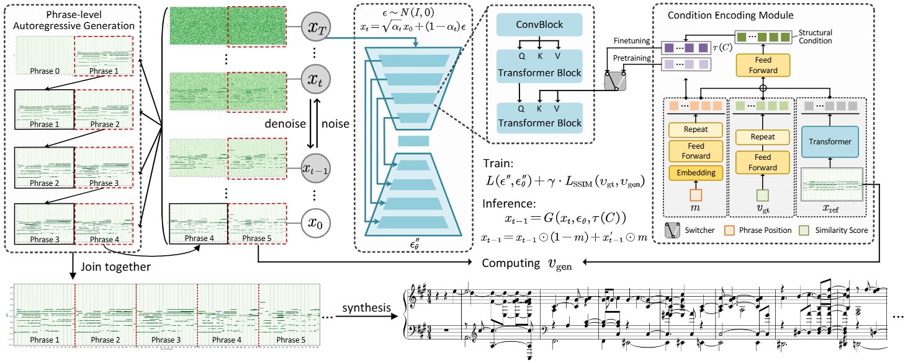

# StrucMusDiff
This is the official implementation of StrucMusDiff, which is a phrase-level autoregressive music generation model based on piano roll music representations and diffusion models, capable of generating polyphonic piano music with long-term structure and controllable phrase length.  

- Check our [demo page](https://tayjsl97.github.io/demos/tmm2) and listen! 

 
